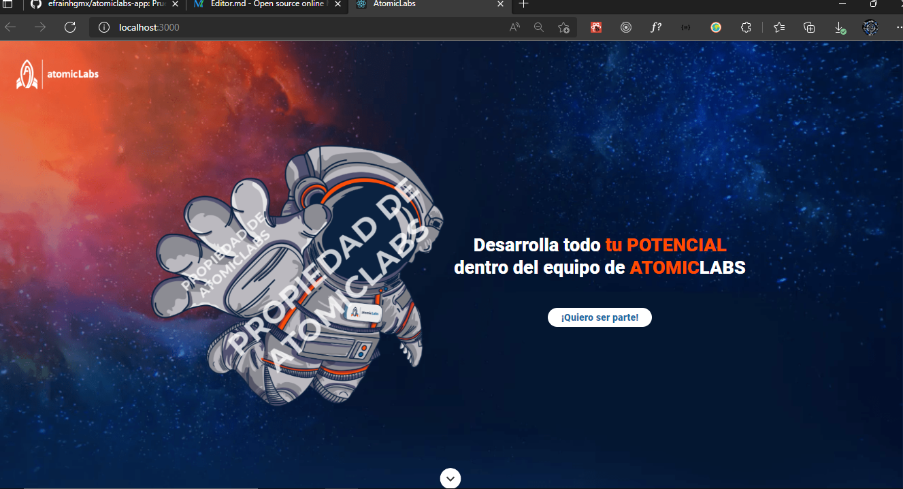

# Prueba Técnica para AtomicLabsmx

Este proyecto esta hecho con **React JS** en su ultima versión, para poder ejecutarlo, clona el proyecto o descargalo mediante un zip.

Abre una terminal de comandos ejecuta el comando `$ node -v` para verificar que cuentas con **Node JS** instalado.

## Lo que necesitas para ejecutar este proyecto es:
1.- Abre la terminal en la carpeta donde esta el proyecto

`$ ~cd/Escritorio/atomiclabs-app`

2.- Una vez ahí instala todo lo necesario para este proyecto usando **npm**

`$ npm install`

3.- Una vez instalado todo, ejecuta el siguiente comando en la terminal:

`$ npm start`

**Al haber hecho bien los pasos anteriores, se te abrira tu navegador en localhost:3000**

### Para este proyecto se utilizo:
- **HTML**
- **CSS**
- **JavaScript**
- **ReactJS**
- **React router**
- **React hook form**

#### Cuenta con algunas mejoras responsive, pero la aplicación esta hecha para desktop.

**Efraín Hernández García, 2022. efrainhgmx.com**